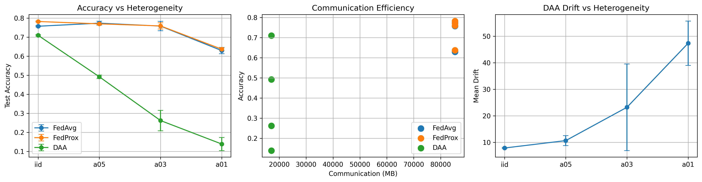
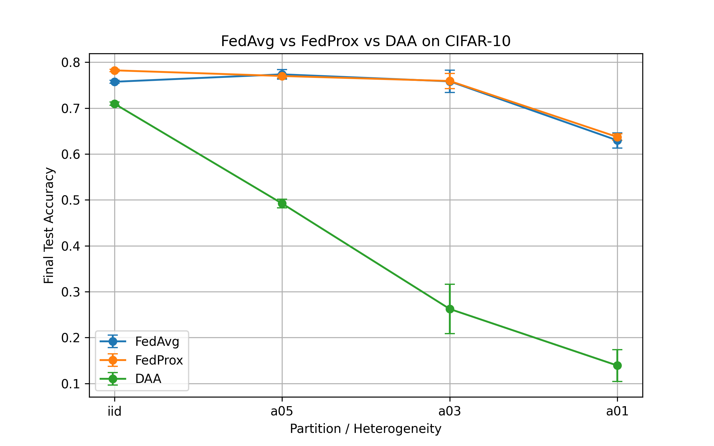
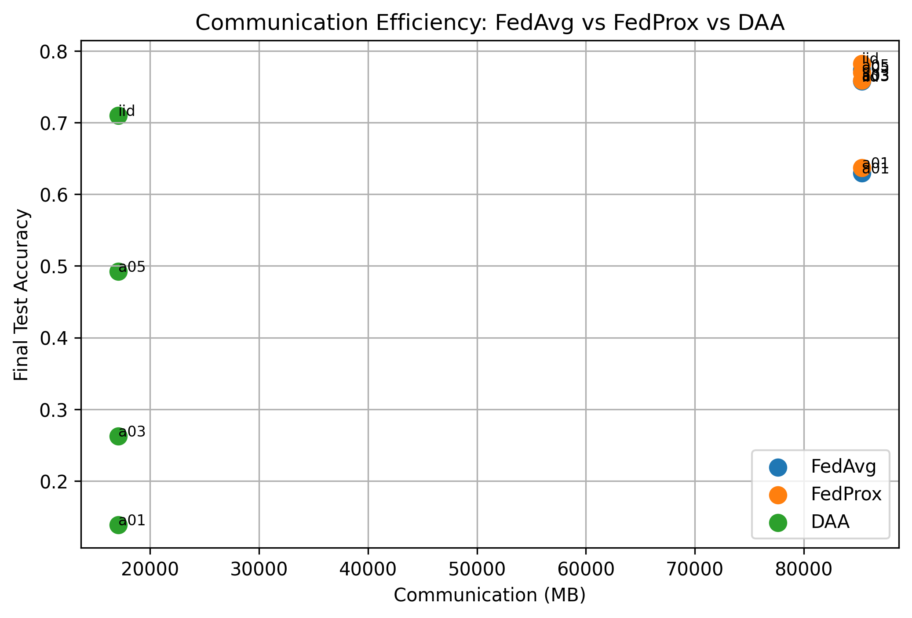
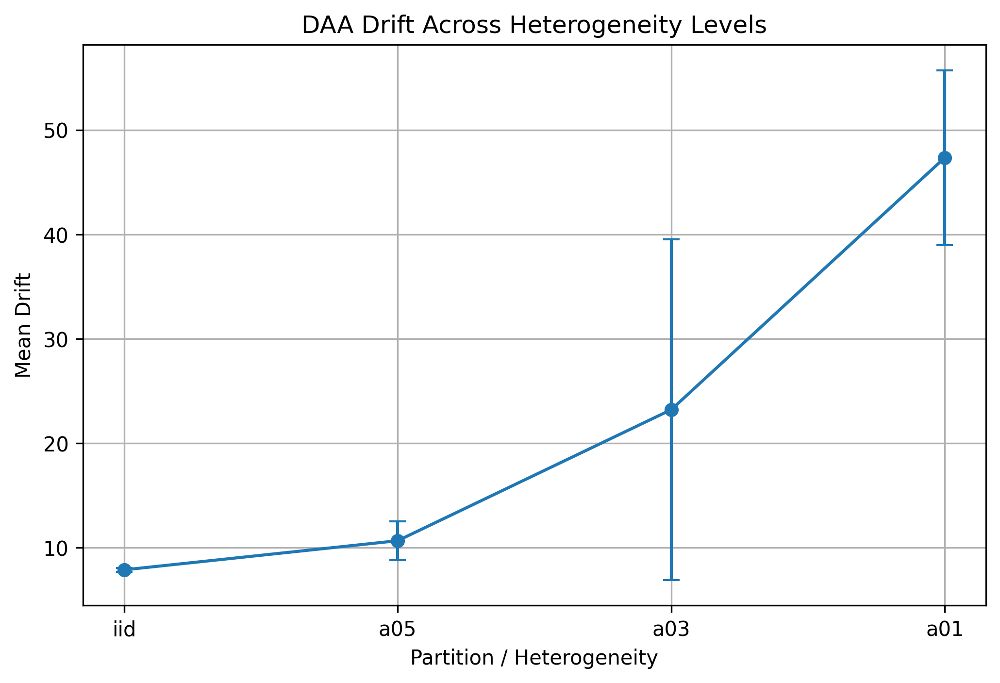

# Drift-Aware Adaptive Aggregation (DAA)

## Federated Learning Under Data Heterogeneity

Federated learning systems frequently operate in environments where client datasets are **strongly non-IID**. Under these conditions, local model updates can diverge substantially, and uniform aggregation methods such as FedAvg may amplify instability rather than correct it.

This repository investigates that phenomenon on **CIFAR-10** and introduces a simple aggregation mechanism called **Drift-Aware Adaptive Aggregation (DAA)**.

Instead of treating all client updates equally, DAA adjusts aggregation weights according to **how far each client update deviates from the mean update direction** during each communication round.

The result is an aggregation rule that remains lightweight while exposing useful diagnostics about update drift and heterogeneity.

---

## Main Experimental Results



The figure summarizes the central empirical findings of the project:

- performance under increasing client heterogeneity
- communication efficiency relative to baseline methods
- measured drift behavior of client updates under DAA

---

## Motivation

Federated learning algorithms are typically evaluated under either IID partitions or mild heterogeneity. However, realistic deployments often exhibit **extreme client distribution skew**, particularly when datasets are partitioned by user behavior or device context.

Under these conditions:

- client gradients can point in conflicting directions
- uniform averaging may overweight noisy or divergent updates
- model convergence may slow or degrade

This project explores whether **update-distance awareness at the server aggregation stage** can partially mitigate this behavior.

---
## Drift-Aware Adaptive Aggregation

Let the update from client $i$ be

$$
\Delta_i = w_i - w_{\text{global}}
$$

where $w_{\text{global}}$ is the current global model maintained by the server.

Compute the mean client update

$$
\bar{\Delta} = \frac{1}{K}\sum_{i=1}^{K} \Delta_i
$$

Drift-Aware Adaptive Aggregation (DAA) assigns a weight to each client update based on its deviation from the mean update direction:

$$
\alpha_i \propto \exp\left(-\beta \|\Delta_i - \bar{\Delta}\|\right)
$$

Clients whose updates drift significantly from the consensus direction receive lower aggregation weight.

The aggregated server update becomes

$$
w_{\text{next}} = w_{\text{global}} + \sum_{i=1}^{K} \alpha_i \Delta_i
$$

This introduces **drift sensitivity** into the aggregation process without modifying client-side optimization or communication patterns.

---

## Experimental Setup

**Dataset**  
CIFAR-10

**Model**  
ResNet architecture for CIFAR classification

**Federated configuration**
- total clients: 20
- clients sampled per round: 10
- communication rounds: 20
- local training: SGD

**Random seeds**
- 1
- 7
- 42

**Client partition regimes**

| Partition Type | Description |
|---|---|
| IID | uniform distribution across clients |
| Dirichlet α = 0.5 | moderate heterogeneity |
| Dirichlet α = 0.3 | strong heterogeneity |
| Dirichlet α = 0.1 | extreme heterogeneity |

**Methods compared**
- FedAvg
- FedProx
- Drift-Aware Adaptive Aggregation (DAA)

---

## Accuracy Under Increasing Heterogeneity



The comparison shows a clear degradation pattern as client heterogeneity increases. FedAvg and FedProx remain strong baselines, while DAA provides an explicitly drift-aware aggregation rule that exposes additional diagnostics about the geometry of client updates.

---

## Communication Efficiency



All methods are evaluated in a common experimental pipeline. The communication plot highlights how final accuracy compares against cumulative communication cost across methods and partition regimes.

---

## Drift Behaviour Under Heterogeneity



A central motivation for DAA is that update drift itself is informative. The drift statistics increase substantially as the partition regime becomes more heterogeneous, suggesting that aggregation quality is tightly coupled to update geometry.

---

## Repository Structure

```text
src/
  fl/
    daa.py
    fedavg.py
    partition.py

scripts/
  run_daa_cifar10.py

configs/
  cifar10/
    daa_cifar10_*.yaml

plots/
  main_results_figure.png
  accuracy_comparison.png
  communication_efficiency.png
  daa_drift_vs_heterogeneity.png
  
```
---

## Reproducibility

Install dependencies

```bash
pip install -r requirements.txt

Example experiment

python -m scripts.run_daa_cifar10 --config configs/cifar10/daa_cifar10_a03_s1.yaml

```
---

## Discussion

The experiments suggest that **client update drift becomes increasingly significant as data heterogeneity grows**.

Standard aggregation methods such as **FedAvg** treat all client updates equally, while **FedProx** introduces proximal regularization to reduce divergence.

The proposed **Drift-Aware Adaptive Aggregation (DAA)** instead adjusts aggregation weights according to how far each update deviates from the mean update direction.

This exposes useful diagnostics about the geometry of client updates while remaining lightweight and compatible with existing federated learning pipelines.


---

## Author Note

This repository was developed as an independent federated learning research project exploring whether **update drift can serve as a useful signal for server aggregation under heterogeneous client data distributions**.

The project includes:

- implementation of a drift-aware aggregation rule
- controlled non-IID partition experiments
- multi-seed evaluation
- communication efficiency analysis
- diagnostic plots for client update drift

The goal was to build a **fully reproducible experimental artifact** that demonstrates how changes to aggregation rules can reveal useful insights about federated optimization dynamics.


